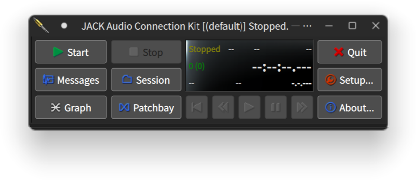
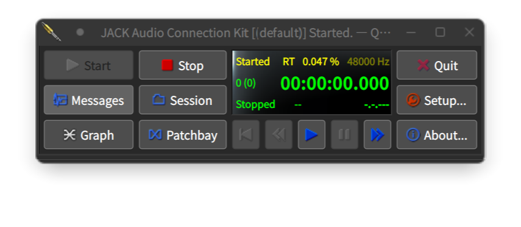
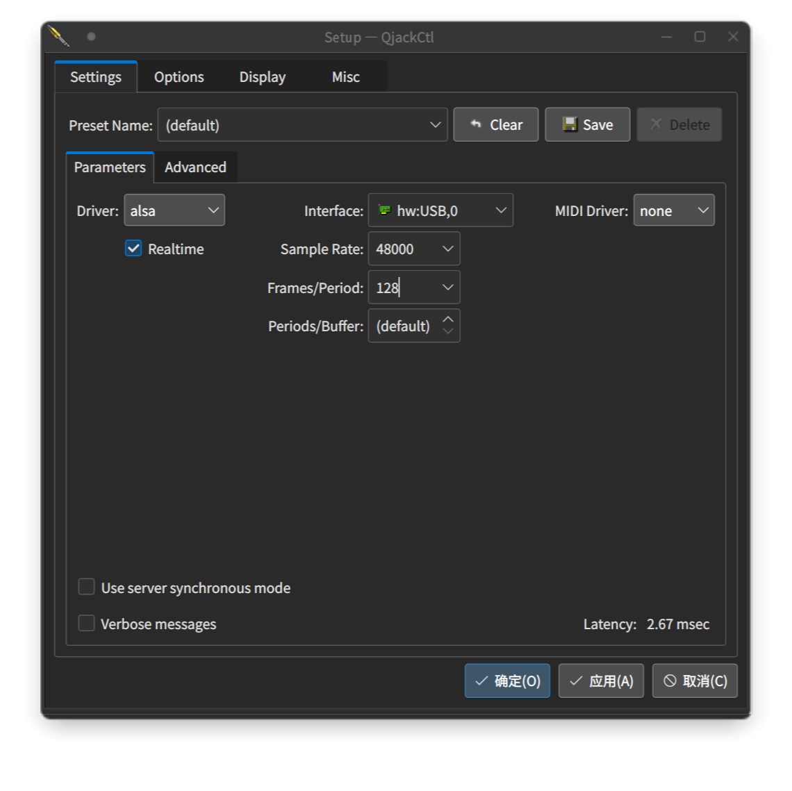
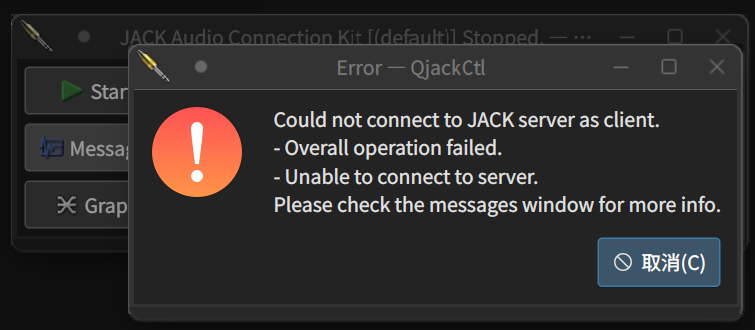
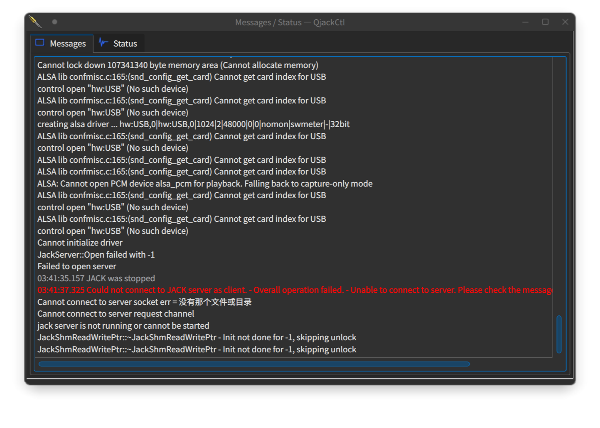
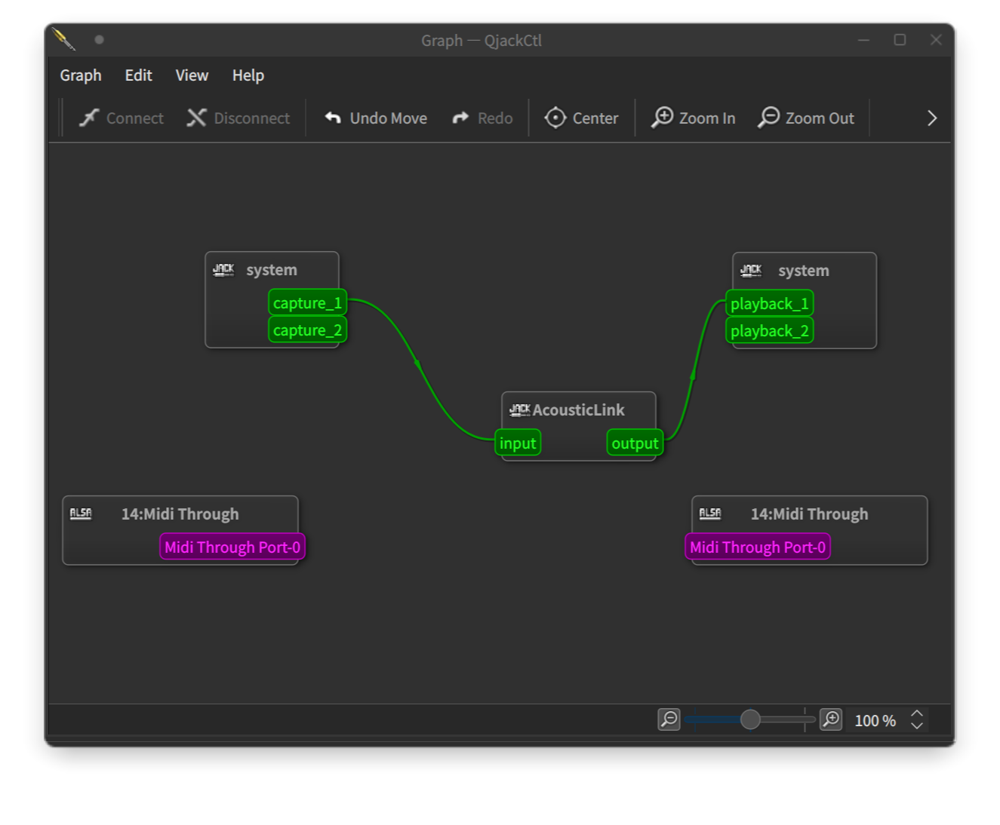

# JACK Starter

这是一份粗糙的 JACK 入门使用指南。

> **注：**`在 Go 中使用 JACK` 部分的示例代码逻辑与 Rust 版本的示例代码逻辑相同，因此不会详细解释每个示例在做什么，因此如有不清楚的细节请参考 `在 Rust 中使用 JACK` 部分。

## 目录

- [为什么不用 ASIO](#为什么不用-asio)
- [为什么选择 Rust 或 Go](#为什么选择-rust-或-go)
- [设置 JACK 服务器](#设置-jack-服务器)
  - [Windows](#windows)
  - [macOS](#macos)
  - [Linux](#linux)
- [启动 JACK 服务器](#启动-jack-服务器)
- [配置 Rust 工具链](#配置-rust-工具链)
  - [Windows](#windows-1)
  - [macOS](#macos-1)
  - [Linux](#linux-1)
- [在 Rust 中使用 JACK](#在-rust-中使用-jack)
- [配置 Go 工具链](#配置-go-工具链)
  - [Windows](#windows-2)
  - [macOS](#macos-2)
  - [Linux](#linux-2)
- [在 Go 中使用 JACK](#在-go-中使用-jack)
- [结语](#结语)

## 为什么不用 ASIO

众所周知，ASIO 原生只能在 Windows 上使用，而 JACK 是跨平台的，你能在 Linux、macOS、Windows 等系统上使用它。JACK 的使用比 ASIO 更简单，不仅体现在库的 API 比较容易理解，还自带一个好看易用的 QjackCtl 客户端。此外，ASIO 常常在操作时出现奇怪的卡顿（有待证实）。

## 为什么选择 Rust 或 Go

Java 搭配 Maven 或 Gradle 管理依赖是繁琐的，学习和使用并不简单，且能使用的库较少，标准库的功能较匮乏，语法糖较少，因此你可能需要写很多代码。C++ 的复杂度众所周知，且 C++ 的包管理同样麻烦，需要处理大量依赖问题，使用 C++ 进行并发编程很难保证并发安全，你可能会写出很多错误而无处开修。Python 的性能较差，容易遇到性能问题。

而 Go 和 Rust 拥有海量的库和现代的包管理系统，让你觉得找到一个合适的包并安装它真的是小菜一碟，你会享受于找个包然后使用它，而不是重新造轮子。同时，用 Go 和 Rust 创建的项目相比 Java 有更简洁的结构。此外，它们相比 Python 有更好的性能，这样你就不会浪费时间去额外做性能优化。Go 像 Python 一样容易学习，语言本身自带简单强大且安全的并发系统，而性能却几乎能与 C++、Rust 等语言媲美。Rust 的所有权和生命周期系统让它相较于 C++，内存安全性和并发安全性拥有更加充分的保障，虽然它相对 Go 上手会更难一些。

## 设置 JACK 服务器

### Windows

对于 Windows 11 和较新版本的 Windows 10，你可以使用系统自带的 winget 工具来安装 JACK：

```powershell
winget install Jackaudio.JACK2
```

或打开 JACK 的官方 [下载页面](https://jackaudio.org/downloads)，下载对应的安装包并安装。

### macOS

如果你已经安装过 Homebrew，可以通过以下命令安装 jack：

```bash
brew install jack qjackctl
```

或打开 JACK 的官方 [下载页面](https://jackaudio.org/downloads)，下载对应的安装包解压并安装。

### Linux

请使用对应发行版的包管理器安装 `jack` 和 `qjackctl`：

**Debian/Ubuntu:**

```bash
$ sudo apt install jackd2 qjackctl
```

**Archlinux:**

```bash
$ sudo pacman -S jack2 qjackctl
```

在完成上述的安装步骤后，你将拥有 JACK 并拥有一个叫做 QjackCtl 的程序。

## 启动 JACK 服务器

打开 QjackCtl，它的界面长这个样子：



点击 `Start` 就能启动 JACK 服务器。



如果使用课程提供的声卡进行测试，需要做一些简单的配置。先点击 `Setup`，在 `Interface` 中选中你的 USB 声卡，在 `Sample Rate` 中选择 48000，在 `Frames/Period` 中选择 128 或 256，点击确定以应用设置。

> 实测课程发布的白色绿联声卡设置缓冲区大小为 128 时 RTT 在 12ms 左右，你可以下载并使用 `JACK_delay` 实用程序来测试真实延迟。



如果点击 `Start` 后没有反应，或者弹出报错窗口，可以点击 `Message` 查看错误信息，譬如之前插上 USB 声卡时更改了 `Interface`，但是在拔下声卡时点击了 `Start`。



此时就会报错找不到声卡：



## 配置 Rust 工具链

### Windows

对于 Windows 11 和较新版本的 Windows 10，你可以使用系统自带的 winget 工具来安装 rustup：

```powershell
winget install Rustlang.Rustup
```

或打开 rustup 的官方 [下载页面](https://rustup.rs)，下载对应的安装包并安装。

以上方法都需要重启已打开的终端以使环境变量生效。

### macOS

如果你已经安装过 Homebrew，可以通过以下命令安装 rustup：

```bash
brew install rustup
```

或打开 rustup 的官方 [下载页面](https://rustup.rs)，下载对应的安装包并安装。

### Linux

请使用对应发行版的包管理器安装 `rustup`：

**Debian/Ubuntu:**

```bash
$ sudo apt install rustup
```

**Archlinux:**

```bash
$ sudo pacman -S rustup
```

在完成上述的安装步骤后，你应当能通过 `rustup --version` 命令查看已安装的 rustup 版本。

## 在 Rust 中使用 JACK

现在我们来创建一个新项目：

```bash
cargo new acoustic_link
```

进入这个目录，然后添加 `jack` 依赖：

```bash
cd acoustic_link
cargo add jack
```

然后编辑 `src/main.rs`，替换成以下代码：

```rust
fn main() {
    let (client, _status) =
        jack::Client::new("AcousticLink", jack::ClientOptions::default()).unwrap();

    let in_port = client
        .register_port("input", jack::AudioIn::default())
        .unwrap();
    let mut out_port = client
        .register_port("output", jack::AudioOut::default())
        .unwrap();

    let in_port_name = in_port.name().unwrap();
    let out_port_name = out_port.name().unwrap();

    let process_callback = move |_: &jack::Client, ps: &jack::ProcessScope| -> jack::Control {
        let in_port_slice = in_port.as_slice(ps);
        let out_port_slice = out_port.as_mut_slice(ps);
        out_port_slice.clone_from_slice(in_port_slice);
        jack::Control::Continue
    };

    let process = jack::contrib::ClosureProcessHandler::new(process_callback);
    let active_client = client.activate_async((), process).unwrap();

    let client = active_client.as_client();
    client.connect_ports_by_name("system:capture_1", &in_port_name).unwrap();
    client.connect_ports_by_name(&out_port_name, "system:playback_1").unwrap();

    println!("Press enter or return to quit...");
    let mut user_input = String::new();
    std::io::stdin().read_line(&mut user_input).ok();

    active_client.deactivate().unwrap();
}
```

在这段代码中，我们首先创建了一个叫做 `AcousticLink` 的 JACK 客户端，并且向他注册了一个输入端口 `input` 和一个输出端口 `output`。

然后，我们创建了一个回调函数（闭包）。在这个回调函数中，我们获得了 `input` 端口和 `output` 端口的缓冲区，并将 `input` 端口的缓冲区中的内容拷贝到了 `output` 端口的缓冲区中。这样就实现了在扬声器中实时输出麦克风录制的内容的效果。

接着，我们按照库的要求，使用 `ClosureProcessHandler::new()` 将之前的闭包包装了一下，并将其注册到我们的 JACK 客户端，此时 JACK 客户端已经被激活，开始在音频数据准备完成时（即每 `Frames/Period` $\div$ `Sample Rate` 秒）调用我们之前写的回调函数。

最后，我们将系统默认输入端口的第一个端口 `system:capture_1`（通常是麦克风的左声道）与 `AcousticLink` 的 `input` 端口连接了起来，并将系统默认输出端口的第一个端口 `system:playback_1`（通常是扬声器的左声道）与 `AcousticLink` 的 `output` 端口连接在了一起。

接下来三行是等待输入一个 `Enter` 或 `Return`。因为 JACK 客户端的回调函数是异步运行的，也就是说，它不是在 `main` 函数所在的线程中运行的，因此如果不添加这三行，程序会立即执行到最后一行并结束。

执行以下命令来运行这个程序：

```bash
$ cargo run
```

这时所有麦克风录制的音频都会从扬声器中播放出来。（小心啸叫！）

如果你点击 QjackCtl 中的 `Graph`，你应该能看到有一个叫做 `AcousticLink` 的客户端，它有两个端口，并且与系统的两个指定的端口相连接。



此时我们已经可以在 JACK 客户端的回调函数中获取到音频数据了，那么我们应当如何在其他线程中读写 JACK 客户端的缓冲区呢？毕竟在这个项目中我们需要同时处理输入和输出，因此会启动两个甚至更多的线程。一个简单的做法是使用 `Arc`（原子引用计数器）和 `Mutex`（互斥锁）来包裹一个数组或队列，但我想推荐的是 channel，使用它我们就能高效且便捷地编写阻塞与非阻塞的在不同线程间传递数据的代码。

在这里我使用的 channel 实现是 `crossbeam-channel`，你也可以使用其他实现，用法大同小异。首先我们先安装依赖：

```bash
cargo add crossbeam-channel
```

然后编辑 `src/main.rs`，替换成以下代码：

```rust
fn main() {
    let (client, _status) =
        jack::Client::new("AcousticLink", jack::ClientOptions::default()).unwrap();

    let in_port = client
        .register_port("input", jack::AudioIn::default())
        .unwrap();
    let mut out_port = client
        .register_port("output", jack::AudioOut::default())
        .unwrap();

    let in_port_name = in_port.name().unwrap();
    let out_port_name = out_port.name().unwrap();

    let (input_sender, input_receiver) = crossbeam_channel::unbounded();
    let (output_sender, output_receiver) = crossbeam_channel::unbounded();

    let process_callback = move |_: &jack::Client, ps: &jack::ProcessScope| -> jack::Control {
        let in_port_slice = in_port.as_slice(ps);
        let out_port_slice = out_port.as_mut_slice(ps);

        for input in in_port_slice.iter() {
            input_sender.try_send(*input).unwrap();
        }
        for output in out_port_slice.iter_mut() {
            *output = output_receiver.try_recv().unwrap_or(0.0)
        }

        jack::Control::Continue
    };

    // Create a 4800 size buffer and loop to recv data from input_sender
    // When the buffer is full, print the average value and clear the buffer
    std::thread::spawn(move || {
        let mut buffer = Vec::with_capacity(4800);
        loop {
            buffer.push(input_receiver.recv().unwrap());
            if buffer.len() == 4800 {
                let sum: f32 = buffer.iter().sum();
                println!("Average value: {}", sum / 4800.0);
                buffer.clear();
            }
        }
    });

    // Create a 40 = 48000 / 1200 size array to store data of square wave
    // Loop to send the array to output_sender
    std::thread::spawn(move || {
        let square_wave_slice = [[0.0; 20], [1.0; 20]].concat();
        loop {
            for sample in square_wave_slice.iter() {
                output_sender.send(*sample).unwrap();
            }
        }
    });

    let process = jack::contrib::ClosureProcessHandler::new(process_callback);
    let active_client = client.activate_async((), process).unwrap();

    let client = active_client.as_client();
    client
        .connect_ports_by_name("system:capture_1", &in_port_name)
        .unwrap();
    client
        .connect_ports_by_name(&out_port_name, "system:playback_1")
        .unwrap();

    println!("Press enter or return to quit...");
    let mut user_input = String::new();
    std::io::stdin().read_line(&mut user_input).ok();

    active_client.deactivate().unwrap();
}
```

这时你应该能够听到扬声器在播放方波，且终端中在不断输出每 4800 个音频样本的平均值。当你敲下回车键后，程序也随之停止。

> 在这份代码样例中，我们创建了两个无限容量的 channel，每个 channel 有一对 `Sender` 和 `Receiver`。我们在 JACK 的回调函数中将录制到的数据通过 `input_sender` 发送到存储录制数据的 channel 中，并尝试通过 `output_receiver` 读取存储播放数据的 channel，并将数据赋值给缓冲区。注意到我这里使用的是 `try_send` 和 `try_recv`，这时因为根据 `crossbeam-channel` 的设计，`try_send` 和 `try_recv` 是非阻塞操作。对于 `try_send`，当 channel 已满或断开连接时就会抛出 `Err`，而 `try_recv` 是当 channel 为空或断开连接时抛出 `Err`。对于 `send` 和 `recv`，由于它们是阻塞操作，因此只有在断开连接时才会抛出 `Err`，而为空或已满则会产生阻塞。我们自然不希望我们的 JACK 回调函数出现阻塞，因此采用非阻塞操作。值得一提的是对于 `output_receiver` ，我们让当 channel 为空时返回 `0.0` 而不是 `Err`，是因为我们希望 channel 中没有东西时就应该保持安静。如果不赋值零，则会播放巨大的奇怪噪音。

接下来我们尝试让程序能播放与录制 Wave 格式的音频，首先添加 `hound` 依赖：

```bash
cargo add hound
```

然后编辑`src/main.rs`，替换成以下代码：

```rust
const CAPTURE_WAVE_FILE: &str = "../Record.wav";
const PLAYBACK_WAVE_FILE: &str = "../Sample.wav";

fn main() {
    let (client, _status) =
        jack::Client::new("AcousticLink", jack::ClientOptions::default()).unwrap();

    let in_port = client
        .register_port("input", jack::AudioIn::default())
        .unwrap();
    let mut out_port = client
        .register_port("output", jack::AudioOut::default())
        .unwrap();

    let in_port_name = in_port.name().unwrap();
    let out_port_name = out_port.name().unwrap();

    let sample_rate = client.sample_rate() as u32;

    let (input_sender, input_receiver) = crossbeam_channel::unbounded();
    let (output_sender, output_receiver) = crossbeam_channel::unbounded();

    let process_callback = move |_: &jack::Client, ps: &jack::ProcessScope| -> jack::Control {
        let in_port_slice = in_port.as_slice(ps);
        let out_port_slice = out_port.as_mut_slice(ps);

        for input in in_port_slice.iter() {
            input_sender.try_send(*input).unwrap();
        }
        for output in out_port_slice.iter_mut() {
            *output = output_receiver.try_recv().unwrap_or(0.0)
        }

        jack::Control::Continue
    };

    std::thread::spawn(move || {
        let wav_spec = hound::WavSpec {
            channels: 1,
            bits_per_sample: 32,
            sample_rate,
            sample_format: hound::SampleFormat::Float,
        };
        let mut writer = hound::WavWriter::create(CAPTURE_WAVE_FILE, wav_spec).unwrap();
        loop {
            if let Ok(sample) = input_receiver.recv() {
                writer.write_sample(sample).unwrap();
            }
        }
    });

    std::thread::spawn(move || {
        let mut reader = hound::WavReader::open(PLAYBACK_WAVE_FILE).unwrap();
        for sample in reader.samples::<i16>() {
            const AMPLITUDE: f32 = i16::MAX as f32;
            let sample = sample.unwrap() as f32 / AMPLITUDE;
            output_sender.send(sample).unwrap();
        }
    });

    let process = jack::contrib::ClosureProcessHandler::new(process_callback);
    let active_client = client.activate_async((), process).unwrap();

    let client = active_client.as_client();
    client
        .connect_ports_by_name("system:capture_1", &in_port_name)
        .unwrap();
    client
        .connect_ports_by_name(&out_port_name, "system:playback_1")
        .unwrap();

    println!("Press enter or return to quit...");
    let mut user_input = String::new();
    std::io::stdin().read_line(&mut user_input).ok();

    active_client.deactivate().unwrap();
}
```

运行它，你应该能够听到赠送的 `Sample.wav`，敲下回车键结束程序后，你还能见到同时录制的 `Record.wav`。这时你应该能完全切实地体验到 jack 的简易与 channel 的便捷。

## 配置 Go 工具链

### Windows

和安装 rustup 一样，可以使用系统自带的 winget 工具来安装 Go：

```powershell
winget install GoLang.Go
```

以上方法都需要重启已打开的终端以使环境变量生效。

或打开 Go 的官方 [下载页面](https://go.dev/dl/)，下载对应的安装包并安装。

### macOS

如果你已经安装过 Homebrew，可以通过以下命令安装 rustup：

```bash
brew install go
```

或打开 Go 的官方 [下载页面](https://go.dev/dl/)，下载对应的安装包并安装。

### Linux

请使用对应发行版的包管理器安装 `rustup`：

**Debian/Ubuntu:**

```bash
$ sudo apt install golang-go
```

**Archlinux:**

```bash
$ sudo pacman -S go
```

在完成上述的安装步骤后，你应当能通过 `go version` 命令查看已安装的 Go 版本。

## 在 Go 中使用 JACK

首先我们先创建一个新项目，先创建一个目录：

```bash
mkdir acoustic_link
cd acoustic_link
```

然后创建一个项目：

```bash
go mod init acoustic_link
```

在获取依赖前，你可能希望更换国内镜像以加速下载：

```bash
go env -w GOPROXY=https://goproxy.cn,direct
```

然后添加 `go-jack` 依赖：

```bash
go get github.com/xthexder/go-jack
```

我们同样实现一个在扬声器中实时输出麦克风录制的内容的程序，编辑 `main.go`，替换成以下代码：

```go
package main

import (
	"bufio"
	"fmt"
	"os"

	"github.com/xthexder/go-jack"
)

func main() {
	client, _ := jack.ClientOpen("AcousticLink", jack.NoStartServer)
	if client == nil {
		fmt.Println("Could not connect to jack server.")
		return
	}
	defer client.Close()

	inPort := client.PortRegister("input", jack.DEFAULT_AUDIO_TYPE, jack.PortIsInput, 0)
	outPort := client.PortRegister("output", jack.DEFAULT_AUDIO_TYPE, jack.PortIsOutput, 0)

	systemInPort := client.GetPortByName("system:capture_1")
	systemOutPort := client.GetPortByName("system:playback_1")

	process := func(nframes uint32) int {
		inBuffer := inPort.GetBuffer(nframes)
		outBuffer := outPort.GetBuffer(nframes)
		copy(outBuffer, inBuffer)
		return 0
	}

	if code := client.SetProcessCallback(process); code != 0 {
		fmt.Println("Failed to set process callback.")
		return
	}

	if code := client.Activate(); code != 0 {
		fmt.Println("Failed to activate client.")
		return
	}

	client.ConnectPorts(systemInPort, inPort)
	client.ConnectPorts(outPort, systemOutPort)

	fmt.Println("Press enter or return to quit...")
	bufio.NewReader(os.Stdin).ReadString('\n')
}
```

运行这个程序：

```bash
go run main.go
```

这段代码与[此处](#在-rust-中使用-jack)的 Rust 代码是等效的，你应该能听到扬声器在播放麦克风录制的音频。

播放方波的代码此处不再提供，你可以自行尝试实现。

我们直接来实现最后一个例子，即同时录制与播放 Wave 格式的音频。首先添加 `go-wav` 依赖：

```bash
go get github.com/youpy/go-wav
```

Go 自带 channel，我们直接使用它。编辑 `main.go`，替换成以下代码：

```go
package main

import (
	"bufio"
	"fmt"
	"io"
	"math"
	"os"

	"github.com/xthexder/go-jack"
	"github.com/youpy/go-wav"
)

const (
	CAPTURE_WAVE_FILE  = "../Record.wav"
	PLAYBACK_WAVE_FILE = "../Sample.wav"
)

func main() {
	client, _ := jack.ClientOpen("AcousticLink", jack.NoStartServer)
	if client == nil {
		fmt.Println("Could not connect to jack server.")
		return
	}
	defer client.Close()

	inPort := client.PortRegister("input", jack.DEFAULT_AUDIO_TYPE, jack.PortIsInput, 0)
	outPort := client.PortRegister("output", jack.DEFAULT_AUDIO_TYPE, jack.PortIsOutput, 0)

	systemInPort := client.GetPortByName("system:capture_1")
	systemOutPort := client.GetPortByName("system:playback_1")

	inputChannel := make(chan jack.AudioSample, 1024)
	outputChannel := make(chan jack.AudioSample, 1024)

	process := func(nframes uint32) int {
		inBuffer := inPort.GetBuffer(nframes)
		outBuffer := outPort.GetBuffer(nframes)

		for _, sample := range inBuffer {
			inputChannel <- sample
		}

		for i := range outBuffer {
			select {
			case sample := <-outputChannel:
				outBuffer[i] = sample
			default:
				outBuffer[i] = 0.0
			}
		}

		return 0
	}

	go func() {
		file, err := os.Create(CAPTURE_WAVE_FILE)
		if err != nil {
			fmt.Println("Could not create WAV file:", err)
			return
		}
		defer file.Close()

		writer := wav.NewWriter(file, 0, 1, client.GetSampleRate(), 32)

		for {
			sample := <-inputChannel

			samples := make([]wav.Sample, 1)
			samples[0].Values[0] = int(sample * math.MaxInt32)

			err = writer.WriteSamples(samples)
			if err != nil {
				fmt.Println("Error writing samples:", err)
				return
			}
		}
	}()

	go func() {
		file, err := os.Open(PLAYBACK_WAVE_FILE)
		if err != nil {
			fmt.Println("Could not open WAV file:", err)
			return
		}
		defer file.Close()

		reader := wav.NewReader(file)

		for {
			samples, err := reader.ReadSamples(1)
			if err == io.EOF {
				break
			}

			outputChannel <- jack.AudioSample(reader.FloatValue(samples[0], 0))
		}
	}()

	if code := client.SetProcessCallback(process); code != 0 {
		fmt.Println("Failed to set process callback.")
		return
	}

	if code := client.Activate(); code != 0 {
		fmt.Println("Failed to activate client.")
		return
	}

	client.ConnectPorts(systemInPort, inPort)
	client.ConnectPorts(outPort, systemOutPort)

	fmt.Println("Press enter or return to quit...")
	bufio.NewReader(os.Stdin).ReadString('\n')
}
```

这份代码包含了大量异常处理，但实际逻辑与 Rust 版的代码是等效的。另外 Go 自带的 channel 不支持无限容量，因此我们指定了一个 1024 的容量。

## 结语

以上就是这部分教程的全部内容，您可以将本指南提供的所有示例代码用于任何目的。请注意，如果您在自己的项目中使用它们，您需要注明或提及本指南。
